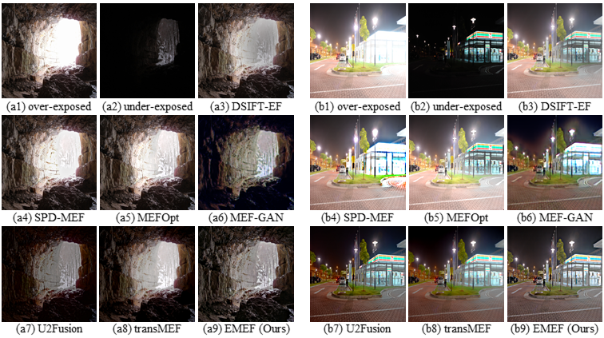

# 🌟 EMEF: Ensemble Multi-Exposure Image Fusion, AAAI 2023 <a href="https://arxiv.org/abs/2305.12734">.svg" ></a> 
- ✨This repository is the official PyTorch implementation of EMEF✨

<!-- 
 -->


## Results
- Download our results from [Google Drive](https://drive.google.com/drive/folders/151LaYxeIk9Q0SZS9dVzucWCqiQ4ejhJe?usp=sharing).
- Download our results from [Baidu Netdisk](https://pan.baidu.com/s/1KIHv6sILjqqUO5dBAk3ptA?pwd=emef) (code: emef).

## Requirements
- Install python and [pytorch](https://pytorch.org/get-started/locally/) correctly. 
- Install other requirements.

Here is the example with the help of conda:
```
conda create -n emef python=3.10
conda activate emef
conda install pytorch torchvision torchaudio pytorch-cuda=12.1 -c pytorch -c nvidia
pip install -r requirements.txt
```

## Datasets
We train EMEF in [SICE](https://github.com/csjcai/SICE).
```
- SICE
  - train
    - gt
      - 001_00.png
      - 001_01.png
      - 001_02.png
      - 001_03.png
      - 002_00.png
      ...
    - oe
      - 1.png
      - 2.png
      ...
    - ue
      - 1.png
      - 2.png
      ...
  - test
    ...
```
We evaluate EMEF in [MEFB](https://github.com/xingchenzhang/MEFB).
```
- MEFB
  - oe
    - 1.png
    - 2.png
    ...
  - ue
    - 1.png
    - 2.png
    ...
```

## Pretrained Model
Here we provide our pretrained model:

[Google Drive](https://drive.google.com/drive/folders/13fIAHG2yAgCIoegbA3mv2jP1ZSglG-nR?usp=drive_link) | [Baidu Netdisk](https://pan.baidu.com/s/1m1ijn6o93mIJ_hsoAxlanw?pwd=emef) (code: emef)

## Get Started
- Start visdom for visualization:
```
python -m visdom.server
```
- Train Stage 1:
```
python train.py --dataroot {path_to_SICE}/train --name demo --model demo --gpu_ids 1 --display_port 8097
```
- Validate Stage 1:
```
python validation.py --dataroot {path_to_SICE}/test --name demo --model demo --phase test --no_dropout --epoch latest --gpu_ids 1
```
- Stage 2:
```
python optimize.py --dataroot {path_to_MEFB} --name demo --model optim --gpu_ids 1 --display_port 8097
```
- Get MEF-SSIM score (*evaldata* has 3 subdirs: fake, oe, ue):
```
python eval.py --dataroot {path_to_evaldata} --name eval --model eval --phase test
```

## Evaluation
- We use the evaluation code from [MEFB](https://github.com/xingchenzhang/MEFB).
- We use a pytorch implementation of [MEF-SSIM](https://github.com/ChuangbinC/pytorch-MEF_SSIM) to optimize and evaluate our results.

## Acknowledgements
Many thanks to [MEFB](https://github.com/xingchenzhang/MEFB) and all of the open source MEF methods. EMEF can't live without their public available code. Many thanks to [pix2pix](https://github.com/junyanz/pytorch-CycleGAN-and-pix2pix) for their excellent GAN framework.

## Citation
If you find our work useful in your research, please cite with:
```
@article{liu2023emef,
  title={EMEF: Ensemble Multi-Exposure Image Fusion},
  volume={37}, 
  url={https://ojs.aaai.org/index.php/AAAI/article/view/25259}, 
  DOI={10.1609/aaai.v37i2.25259}, 
  number={2}, 
  journal={Proceedings of the AAAI Conference on Artificial Intelligence}, 
  author={Liu, Renshuai and Li, Chengyang and Cao, Haitao and Zheng, Yinglin and Zeng, Ming and Cheng, Xuan}, 
  year={2023}, 
  month={Jun.}, 
  pages={1710-1718} 
  }
```